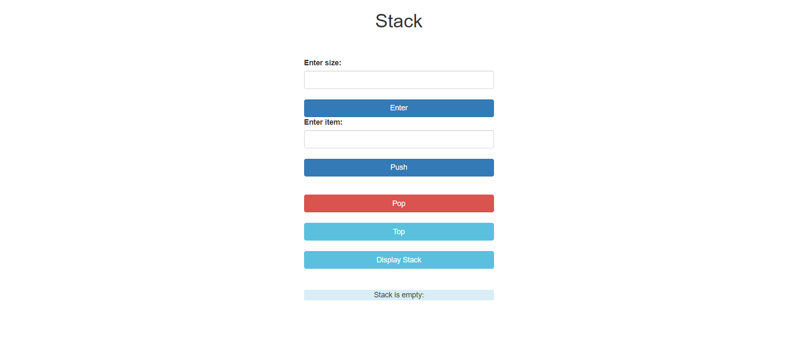

# Simple Stack with Web Interface

Implementing a simple Stack data structure using arrays. Here the stack size is taken as an input from user. One-page web interface is also created to push/pop/display integers in this stack. Also display content of stack on page load/reload.

---

**The REST APIs are written in golang.**

**The Frontend consist of HTML,Bootstrap and javascript**
 
---

## REST APIs

### Declare Stack with given size


```http
  POST /declare - > Create a stack of the given size. Here  size of stack is given in the request body. 
```

### Push item to stack
```http
  POST /push -> Pushes an item to the stack.Item is to push in given in the request body.
```

### Pop item from stack
```http
  DELETE /pop - > Pop the topmost item from stack.
```

### Retrieve content of stack

```http
  GET /display -> Returns the content of the stack.
```
### Retrieve top of stack
```http
  GET /top -> Return the top most item of the stack.
```

---

## Application

